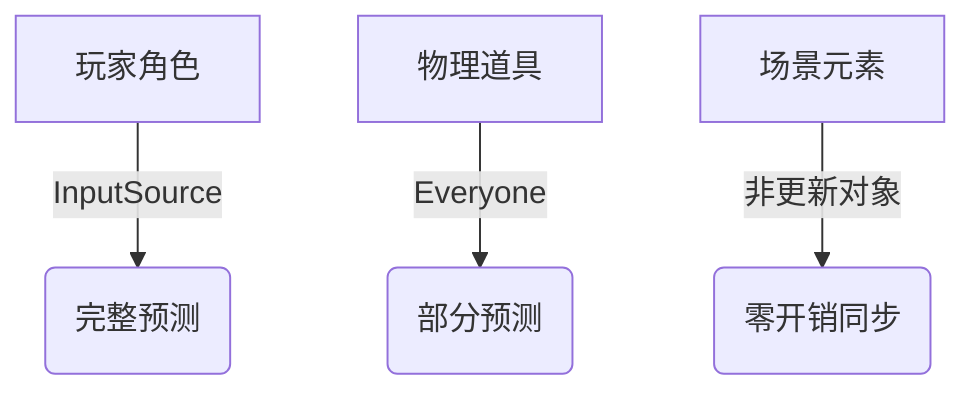
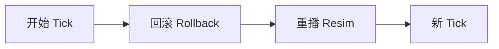
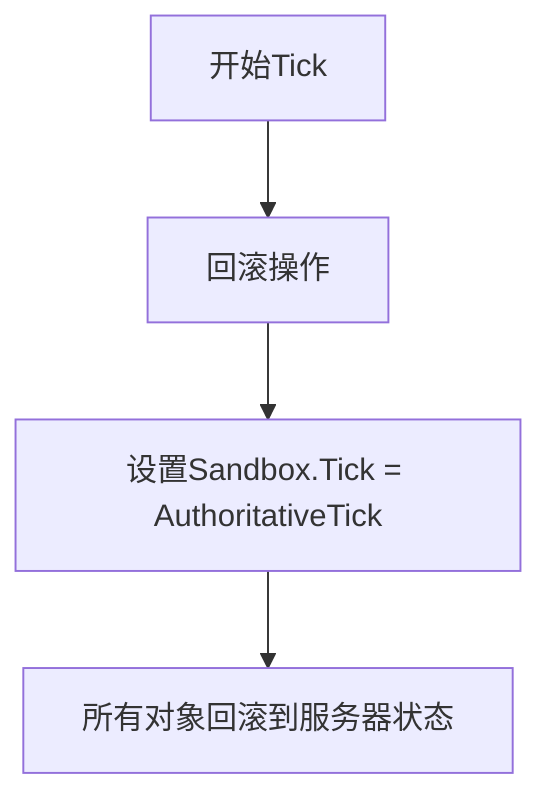
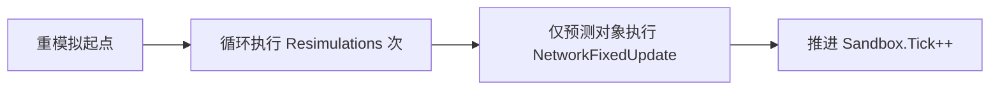
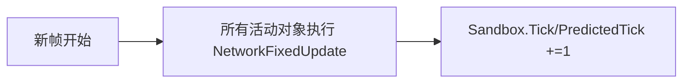
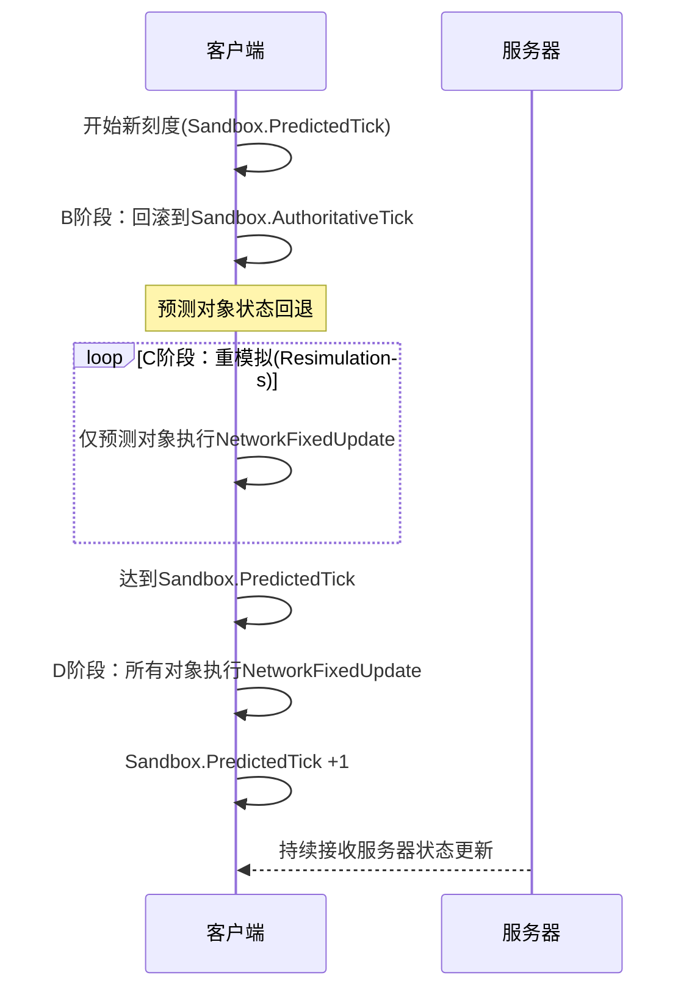

Sandbox.Tick：当前模拟的帧编号

Sandbox.PredictedTick：客户端预测到的最远帧

Sandbox.AuthoritativeTick：从服务器收到的最新权威状态帧

预测对象(Predicted Object)：

你是其输入源的对象（本地玩家角色）

或设置了 Prediction Mode = Everyone 的对象（如物理对象）

预测流程 回滚→重模拟→新帧

回滚阶段 (Rollback)

把游戏时间倒回服务器确认的状态点

`Sandbox.Tick = AuthoritativeTick`

所有预测对象（你的角色）回到过去状态

*非更新对象：直接应用服务器快照

**Resim**

预测对象重播历史操作
仅针对预测对象（InputSource/Everyone模式）

从 AuthoritativeTick 到 PredictedTick 逐tick重播

使用真实输入数据修正历史状态
非预测对象不参与此阶段

每次循环推进1个tick

- 完成后：`Sandbox.Tick = PredictedTick`

- *效果：修正预测错误，保持流畅* <=插值

  **新 Tick**

=>所有对象正常推进
全体对象参与模拟（包括非预测对象）

基于最新输入推进游戏状态

时间线正式进入未来帧

基于当前 Sandbox.Tick 状态渲染画面

玩家看到融合了修正结果的最新画面

**网络延迟与预测误差**：由于网络延迟和固定 tickrate（帧率）限制，客户端无法实时获取远程玩家的输入变化。当玩家快速改变移动方向时，客户端基于历史输入的预测与实际状态不符，导致显示异常（如 “橡皮筋效应”）。

1. **启用预测误差校正平滑**
   
   - 在`NetworkTransform`或`NetworkRigidbody`组件中开启该功能，通过平滑算法减轻预测偏差，使远程玩家的移动更自然。
   - **案例**：在拥挤场景（如购物车推挤游戏）中，开启此功能后，碰撞时的预测错误变得可接受。

2. **添加输入延迟**
   
   - 为所有玩家的输入添加固定延迟（如 1-2 个 tick），使客户端有更充足的时间接收并同步远程玩家的真实状态，减少预测误差。
   - **文档参考**：深入预测机制的相关文档中提供了具体实现示例。

3. **根据游戏类型调整预测策略**
   
   - **FPS / 第三人称射击游戏**：通常仅预测本地玩家，不预测远程玩家，避免高延迟下的严重预测错误，保证游戏流畅性（即使 ping 值达 500ms 也可接受）。
   - **物理驱动类游戏（如赛车）**：因需要玩家物理碰撞，必须预测远程玩家，但需结合误差平滑缓解视觉问题。

4. **理解延迟阈值的影响**
   
   - 远程玩家预测在 ping 值 <150ms 时效果较好，超过此值时，预测偏差会显著恶化；过度平滑则会导致 “橡皮筋效应”。

预测远程玩家只有在 150 毫秒以下才能正常工作，超过这个时间，客户端会预测太多，错误预测总是看起来很糟糕，而过多的平滑会导致您所描述的问题。
这就是为什么我个人更喜欢只预测本地玩家，而不预测远程玩家的 FPS 策略。即使 ping 值高达 500 毫秒，这种策略也能带来非常流畅、可玩性的体验。

对于物理

几乎所有进行物理预测的 AAA 游戏都是在非确定性物理引擎上进行的。因为所有主流引擎都是非确定性的。
只是浮点误差太小，不易察觉。

对象分级：

核心对象 → Everyone模式

次要对象 → InputSource模式

静态对象 → 非更新模式

非本地对象在 `InputSource` 模式下是"半预测"，只在时间点对齐时微*​

- ⚙️ ​**纯代理角色**​：非预测对象本质是**服务器状态的被动接收者**，在客户端没有实际模拟
- 🕰️ ​**时间冻结**​：停留在`Sandbox.AuthoritativeTick`（最新服务器刻度），不会推进到预测刻度
- ⚠️ ​**NetworkFixedUpdate 的局限性**​：虽被调用但**不产生实际模拟效果**，主要提供代码执行入口

对象类型                     回滚阶段     重模拟阶段    新帧阶段
本地输入源    重置状态     完整重播n次    正常推进
非本地输入源    重置状态     跳过                    正常推进
非更新对象      应用服务器快照     无操作                    无操作

 Everyone 模式
对象类型                    回滚阶段    重模拟阶段    新帧阶段
所有预测对象    重置状态    完整重播n次    正常推进
非更新对象    应用服务器快照    无操作    无操作

所以完整流程类似这样

| ​**特性**​                   | 预测对象                  | 非预测对象                     |
| -------------------------- | --------------------- | ------------------------- |
| ​**时间轴**​                  | Sandbox.PredictedTick | Sandbox.AuthoritativeTick |
| ​**重模拟参与**​                | ✅ 完全参与                | ❌ 不参与                     |
| ​**状态连续性**​                | 有回滚/重模拟               | 直接跳变                      |
| ​**NetworkFixedUpdate作用**​ | 实际状态计算                | 无状态变更                     |

