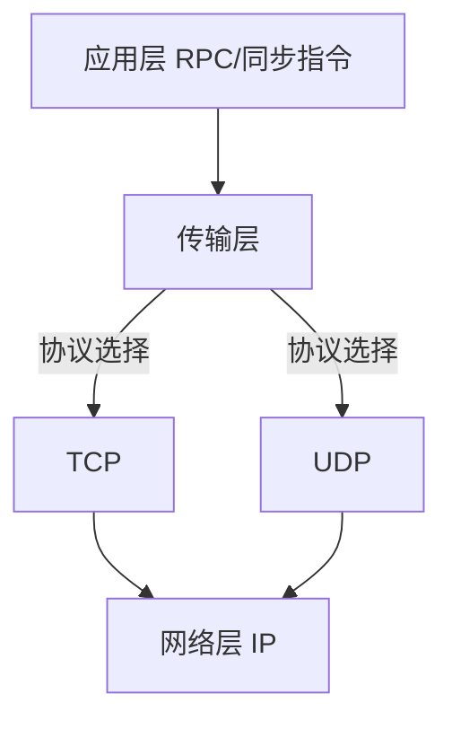

在计算机科学和游戏开发领域，​**Network（网络）​**​ 指通过物理/无线连接实现的**分布式设备通信系统**

​**Network = 节点（Node） + 连接（Connection） + 协议（Protocol）​**

### Unity中的网络框架中

Transport（传输层）= Network



### 

```markdown
```csharp

using Unity.Networking.Transport;

NetworkDriver driver = new NetworkDriver();
// 绑定本地端口
NetworkEndPoint endpoint = NetworkEndPoint.AnyIpv4;
endpoint.Port = 9000;
if (driver.Bind(endpoint) != 0)
 Debug.Log("Failed to bind to port 9000");
else
 driver.Listen();
```

### UDP vs TCP 协议对比

| 特性         | UDP (用户数据报协议)     | TCP (传输控制协议)     |
| ---------- | ----------------- | ---------------- |
| ​**连接方式**​ | 无连接               | 面向连接（三次握手）       |
| ​**可靠性**​  | ❌ 不保证顺序<br>❌ 可能丢包 | ✅ 可靠传输<br>✅ 顺序保证 |
| ​**头部开销**​ | 8字节               | 20-60字节          |
| ​**传输速度**​ | ⚡ 极快（直接发送）        | 🐢 较慢（需确认机制）     |

场景：

UDP 玩家移动 

TCP 聊天 

现代游戏多采用 ​**UDP为主、TCP为辅**​ 的混合架构，Unity UTP通过可靠/不可靠双通道设计，实现90%场景的协议无缝切换。竞技类游戏通常维持 ​**UDP占比>85%​**​ 的高性能传输配置
