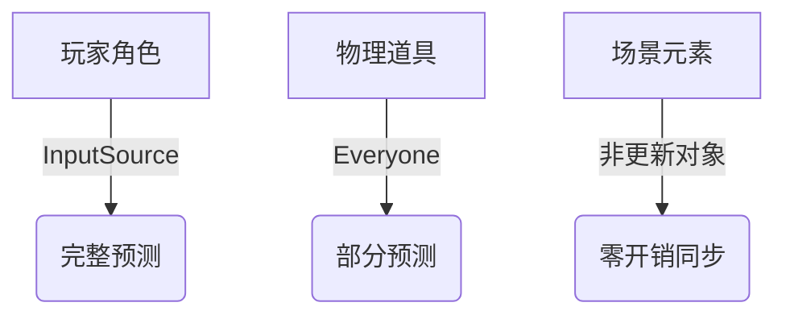
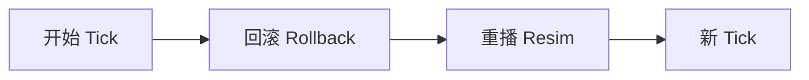
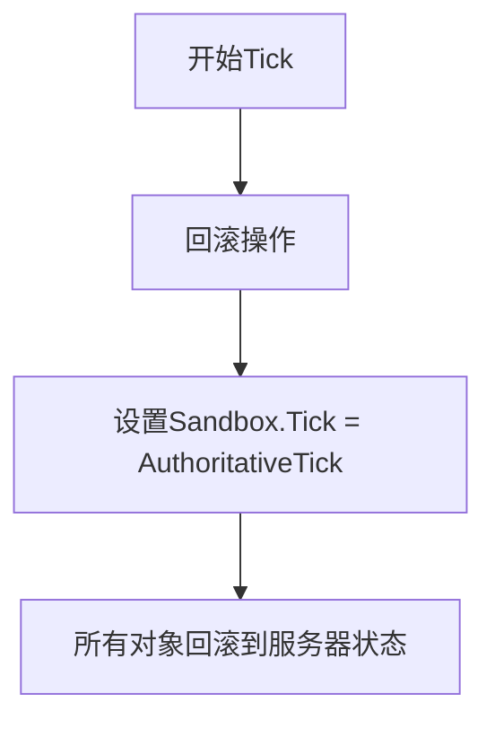
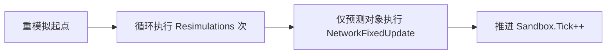
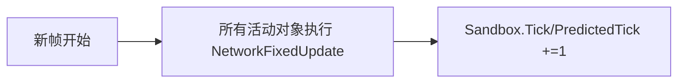

预测流程 回滚→重模拟→新帧

回滚阶段 (Rollback)

把游戏时间倒回服务器确认的状态点

`Sandbox.Tick = AuthoritativeTick`

所有预测对象（你的角色）回到过去状态

*非更新对象：直接应用服务器快照

**Resim**

预测对象重播历史操作
仅针对预测对象（InputSource/Everyone模式）

从 AuthoritativeTick 到 PredictedTick 逐tick重播

使用真实输入数据修正历史状态
非预测对象不参与此阶段

每次循环推进1个tick

- 完成后：`Sandbox.Tick = PredictedTick`

- *效果：修正预测错误，保持流畅* <=插值

**新 Tick**

=>所有对象正常推进
全体对象参与模拟（包括非预测对象）

基于最新输入推进游戏状态

时间线正式进入未来帧

基于当前 Sandbox.Tick 状态渲染画面

玩家看到融合了修正结果的最新画面

对象分级：

核心对象 → Everyone模式

次要对象 → InputSource模式

静态对象 → 非更新模式

非本地对象在 `InputSource` 模式下是"半预测"，只在时间点对齐时微

对象类型	                 回滚阶段	 重模拟阶段	新帧阶段
本地输入源	重置状态	 完整重播n次	正常推进
非本地输入源	重置状态	 跳过	                正常推进
非更新对象      应用服务器快照	 无操作	                无操作

 Everyone 模式
对象类型	                回滚阶段	重模拟阶段	新帧阶段
所有预测对象	重置状态	完整重播n次	正常推进
非更新对象	应用服务器快照	无操作	无操作

