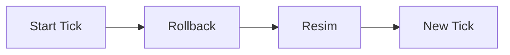
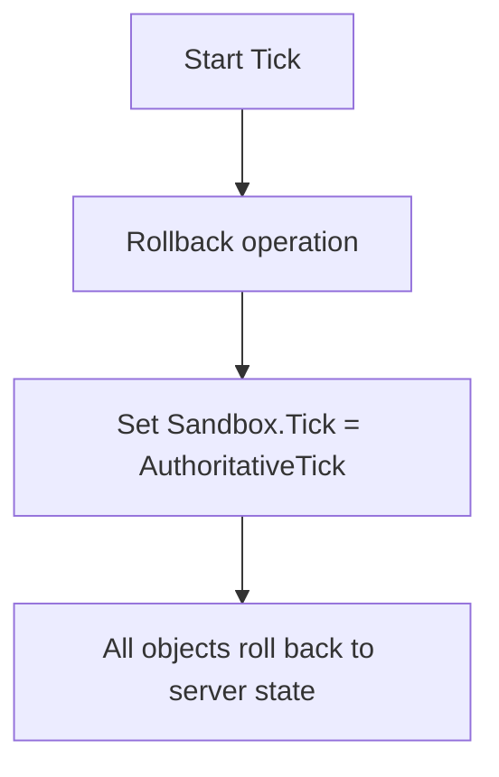
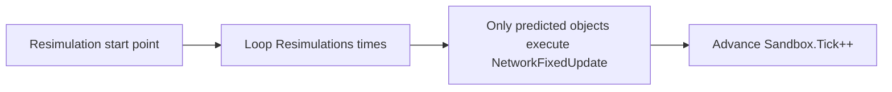
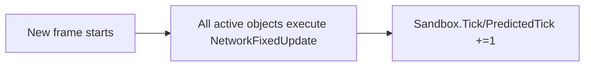
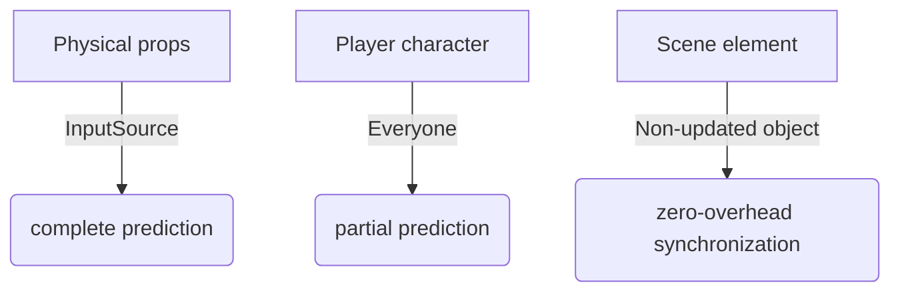

Prediction process Rollback → Resim → New frame

Rollback phase (Rollback)

Rewind the game time to the state point confirmed by the server

`Sandbox.Tick = AuthoritativeTick`

All predicted objects (your characters) return to the past state

*Non-updated objects: directly apply server snapshots

**Resim**

Predicted objects replay historical operations
Only for predicted objects (InputSource/Everyone mode)

Replay from AuthoritativeTick to PredictedTick tick by tick

Use real input data to correct historical states
Non-predicted objects do not participate in this stage

Advance 1 tick each loop

- After completion: `Sandbox.Tick = PredictedTick`

- *Effect: Correct prediction errors and keep smooth* <= interpolation

**New Tick**

=>All objects advance normally
All objects participate in the simulation (including non-predicted objects)

Advance the game state based on the latest input

The timeline officially enters the future frame

Render the screen based on the current Sandbox.Tick state

The player sees the latest screen that incorporates the correction results

Object classification:

Core object → Everyone mode

Secondary object → InputSource mode

Static object → Non-updated mode

Non-local objects are "semi-predicted" in `InputSource` mode, and are only slightly adjusted when the time points are aligned

Object type Rollback phase Resimulation phase New frame phase
Local input source Reset state Full replay n times Normal advancement
Non-local input source Reset state Skip Normal progress
Non-updated object Application server snapshot No operation No operation

Everyone mode
Object type Rollback phase Resimulation phase New frame phase
All prediction objects Reset state Full replay n times Normal progress
Non-updated object Application server snapshot No operation No operatio