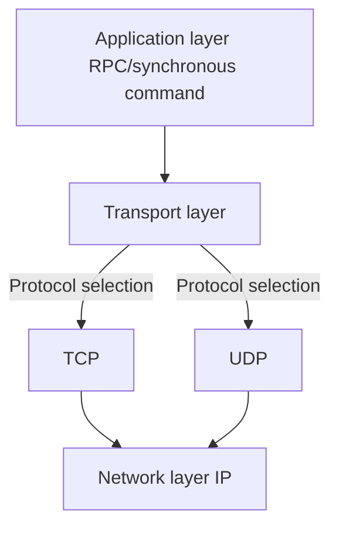

In computer science and game development, ​**Network (network)​**​ refers to a **distributed device communication system** implemented through physical/wireless connections

​**Network = Node + Connection + Protocol​**

### Network framework in Unity

Transport (transport layer) = Network



###

```markdown
```csharp

using Unity.Networking.Transport;

NetworkDriver driver = new NetworkDriver();
// Bind local port
NetworkEndPoint endpoint = NetworkEndPoint.AnyIpv4;
endpoint.Port = 9000;
if (driver.Bind(endpoint) != 0)
Debug.Log("Failed to bind to port 9000");
else
driver.Listen();
```

### UDP vs TCP protocol comparison

| Features | UDP (User Datagram Protocol) | TCP (Transmission Control Protocol) |
| ---------- | ----------------- | ---------------- |
| ​**Connection mode**​ | Connectionless | Connection-oriented (three-way handshake) |
| ​**Reliability**​ | ❌ No order guarantee<br>❌ Packet loss may occur | ✅ Reliable transmission<br>✅ Order guarantee |
| ​**Header overhead**​ | 8 bytes | 20-60 bytes |
| ​**Transmission speed**​ | ⚡ Extremely fast (direct send) | 🐢 Slow (confirmation mechanism required) |

Scenario:

UDP player movement

TCP chat

Modern games mostly use ​**UDP-based, TCP-assisted**​ hybrid architecture, Unity UTP achieves seamless protocol switching in 90% of scenarios through reliable/unreliable dual-channel design. Competitive games usually maintain a high-performance transmission configuration with ​**UDP accounting for >85%​**​