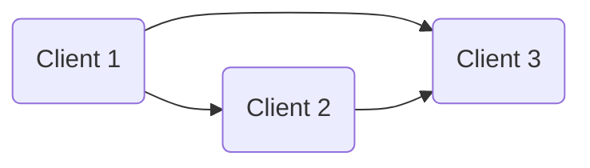
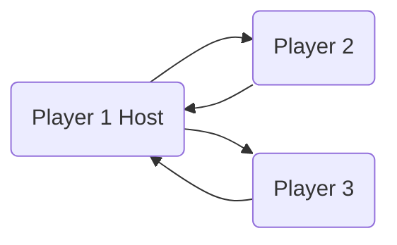

## Network Topology

```mermaid
graph LR
 C1(Client 1) --> S[Authoritative Server]
 C2(Client 2) --> S
 S --> C1
 S --> C2
```

```mermaid
graph LR
 C1(Client 1) --> C2(Client 2)
 C1 --> C3(Client 3)
 C2 --> C3
```

```mermaid
graph LR 
P1(Player 1 Host) --> C2(Player 2)
 C2 --> P1
 P1 --> C3(Player 3)
 C3 --> P1
```